# 🚀 Dashboard Pro - Complete Project Management Platform


> **⚠️ This is a comprehensive demo project showcasing modern web development practices and UI/UX design patterns. All features are fully functional with simulated data and interactions.**

## 🎯 Project Showcase

### 🏠 **Homepage** | 📊 **Dashboard** | 👥 **Team Management** | 📝 **Blog System**
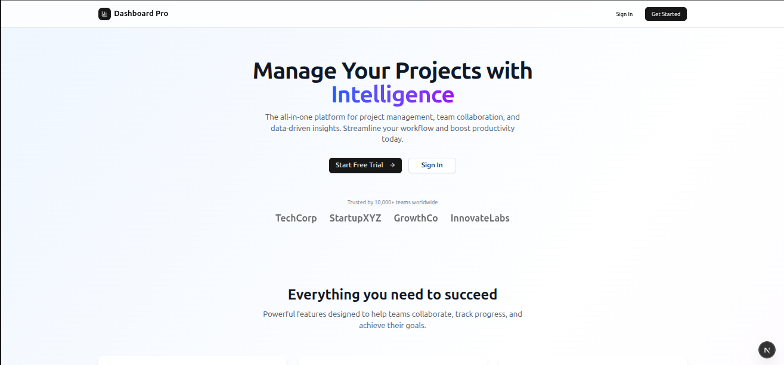 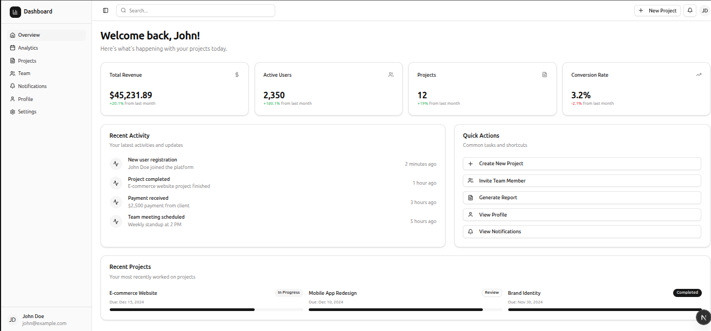 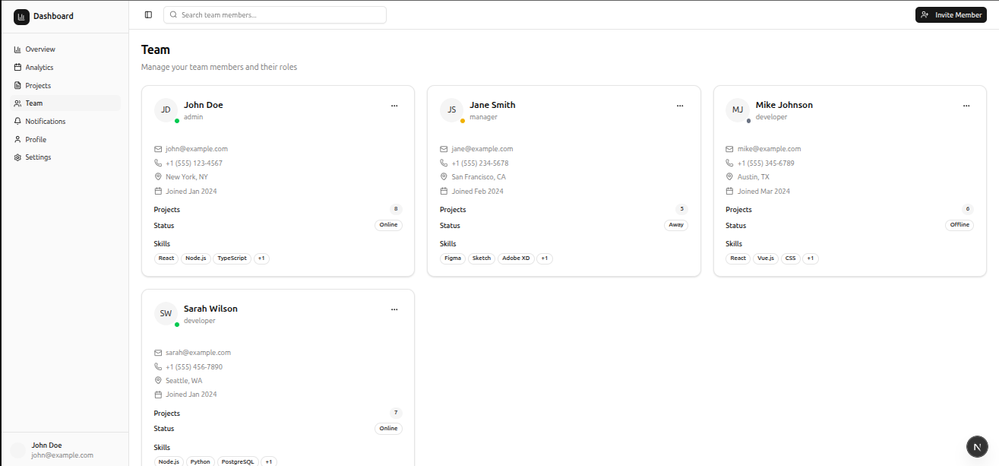 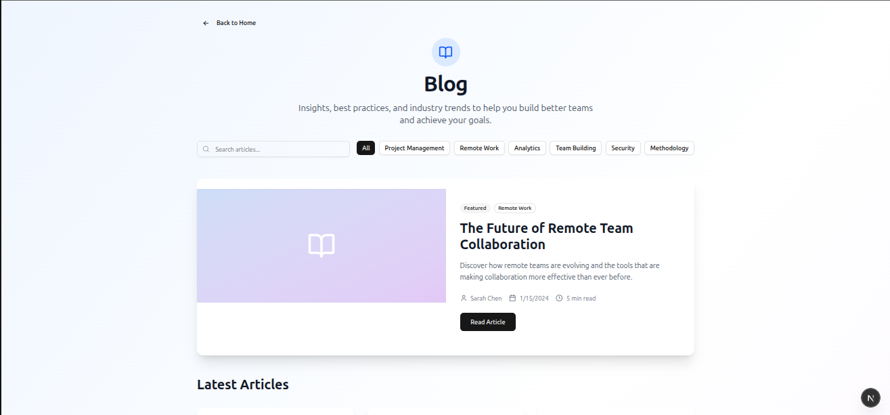

*See all screenshots in the [Screenshots Section](#-screenshots) below*

## 📋 Table of Contents

- [✨ Features](#-features)
- [🗂️ All Pages & Routes](#️-all-pages--routes)
- [🚀 Getting Started](#-getting-started)
- [💻 Tech Stack](#-tech-stack)
- [📸 Screenshots](#-screenshots)
- [👨‍💻 Creator Information](#-creator-information)
- [📞 Contact & Links](#-contact--links)

## ✨ Features

This project includes a complete project management platform with modern authentication, comprehensive dashboard functionality, and professional UI design:

### 🔐 Authentication System
- **Modern Sign In** (`/signin`) - Professional login with social auth options and validation
- **Registration** (`/signup`) - Complete signup flow with form validation
- **Password Recovery** (`/forgot-password`) - Forgot password functionality
- **Protected Routes** - Middleware-based authentication protection

### 📊 Dashboard & Analytics
- **Main Dashboard** (`/dashboard`) - Overview with stats, recent activity, and quick actions
- **Analytics** (`/dashboard/analytics`) - Detailed analytics with charts and metrics
- **Projects** (`/dashboard/projects`) - Complete project management with CRUD operations
- **Team Management** (`/dashboard/team`) - Full team operations with role management
- **Notifications** (`/dashboard/notifications`) - Notification center with preferences
- **Profile** (`/dashboard/profile`) - Comprehensive user profile management
- **Settings** (`/dashboard/settings`) - Account and system configuration

### 🛠️ Advanced Features
- **Create Project** (`/dashboard/create-project`) - Project creation with templates
- **Invite Team** (`/dashboard/invite-team`) - Team invitation and management
- **Generate Reports** (`/dashboard/generate-report`) - Report creation and export
- **Configure Settings** (`/dashboard/configure-settings`) - Advanced user preferences

### 📝 Content Pages
- **Blog** (`/blog`) - Professional blog with article listing
- **Blog Details** (`/blog/[id]`) - Individual blog post pages with full content
- **About** (`/about`) - Company information and mission
- **Careers** (`/careers`) - Job openings and company culture
- **Contact** (`/contact`) - Contact forms and support channels

### 📋 Legal & Compliance
- **Privacy Policy** (`/privacy`) - Comprehensive privacy policy
- **Terms of Service** (`/terms`) - Terms and conditions
- **Security** (`/security`) - Security features and certifications
- **Cookie Policy** (`/cookies`) - Cookie usage and management

### 🎨 Design Features
- **Responsive Design** - Optimized for all screen sizes
- **Dark/Light Mode** - Built-in theme switching
- **Modern UI Components** - Professional shadcn/ui components
- **Interactive Elements** - Hover effects, animations, and transitions
- **Accessibility** - WCAG compliant with proper ARIA labels

## 🗂️ All Pages & Routes

### Public Pages (No Authentication Required)
```
📄 Landing & Marketing
├── /                          - Homepage with hero section and features
├── /about                     - Company story and team information
├── /blog                      - Blog listing with search and filtering
├── /blog/[id]                 - Individual blog post with full content
├── /careers                   - Job openings and company culture
├── /contact                   - Contact forms and support
├── /security                  - Security features and compliance
├── /privacy                   - Privacy policy
├── /terms                     - Terms of service
└── /cookies                   - Cookie policy

🔐 Authentication
├── /signin                    - User login with validation
├── /signup                    - User registration
└── /forgot-password           - Password recovery
```

### Protected Pages (Authentication Required)
```
📊 Dashboard System
├── /dashboard                 - Main dashboard overview
├── /dashboard/analytics       - Detailed analytics and metrics
├── /dashboard/projects        - Project management interface
├── /dashboard/team            - Team management and collaboration
├── /dashboard/notifications   - Notification center
├── /dashboard/profile         - User profile management
└── /dashboard/settings        - Account and system settings

🛠️ Management Tools
├── /dashboard/create-project  - Project creation wizard
├── /dashboard/invite-team     - Team invitation system
├── /dashboard/generate-report - Report generation and export
└── /dashboard/configure-settings - Advanced preferences
```

## 🚀 Getting Started

### Prerequisites
- Node.js 18+
- npm, yarn, pnpm, or bun

### Installation

1. **Clone the repository**
   ```bash
   git clone <repository-url>
   cd dashboard-pro
   ```

2. **Install dependencies**
   ```bash
   npm install
   # or
   yarn install
   # or
   pnpm install
   # or
   bun install
   ```

3. **Run the development server**
   ```bash
   npm run dev
   # or
   yarn dev
   # or
   pnpm dev
   # or
   bun dev
   ```

4. **Open your browser**
   Navigate to [http://localhost:3000](http://localhost:3000)

5. **View Screenshots (Optional)**
   ```bash
   # View all project screenshots
   open images/
   # or on Windows
   start images/
   # or manually navigate to the images/ folder in your project
   ```

### Demo Credentials
- **Email:** Any valid email format
- **Password:** Any password (demo authentication)

> **📸 Screenshots:** All project screenshots are available in the `/images` directory. You can view them by opening the image files directly in your browser or image viewer.

## 💻 Tech Stack

- **Framework:** Next.js 16 with App Router
- **Language:** TypeScript 5.0
- **Styling:** Tailwind CSS 3.4
- **UI Components:** shadcn/ui component library
- **Icons:** Lucide React
- **State Management:** React hooks with TypeScript
- **Authentication:** Cookie-based (demo implementation)
- **Routing:** Next.js App Router with middleware
- **Forms:** React Hook Form with validation
- **Animations:** CSS transitions and Tailwind animations

## 🎯 Key Features Implemented

### Team Management
- ✅ Complete CRUD operations for team members
- ✅ Role-based permissions (Admin, Manager, Developer, Viewer)
- ✅ Email and messaging system
- ✅ Profile editing and status management
- ✅ Team invitation and onboarding

### Project Management
- ✅ Project creation with templates
- ✅ Team assignment and collaboration
- ✅ Progress tracking and status updates
- ✅ File management and sharing
- ✅ Project analytics and reporting

### User Experience
- ✅ Responsive design for all devices
- ✅ Dark/Light mode support
- ✅ Professional UI with consistent design language
- ✅ Interactive elements with feedback
- ✅ Accessibility compliance (WCAG)

### Blog System
- ✅ Article listing with search and filtering
- ✅ Individual blog post pages with full content
- ✅ Category and tag system
- ✅ Social sharing functionality
- ✅ Newsletter subscription

## 📸 Screenshots

> **📁 All screenshots are available in the `/images` directory of this project. You can view them directly by opening the image files in your browser or image viewer.**

The application includes comprehensive screenshots demonstrating all features:

### 🏠 **Landing & Authentication**

*Homepage with hero section, features, testimonials, and call-to-action*

### 📊 **Dashboard System**

*Main dashboard with stats, recent activity, and quick actions*

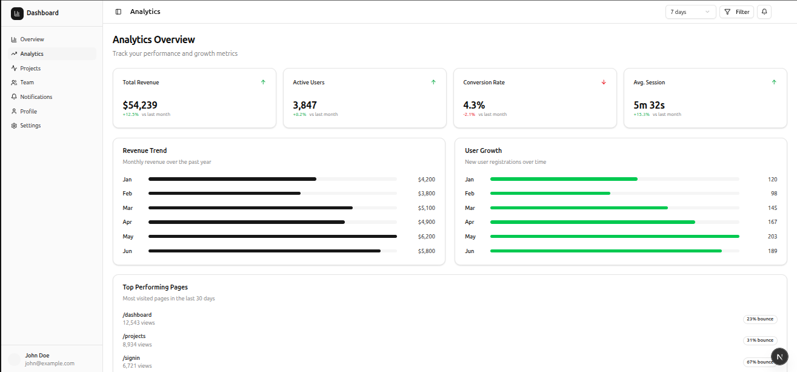
*Detailed analytics with charts, metrics, and performance tracking*

### 👥 **Team Management**

*Team collaboration interface with member cards and role management*

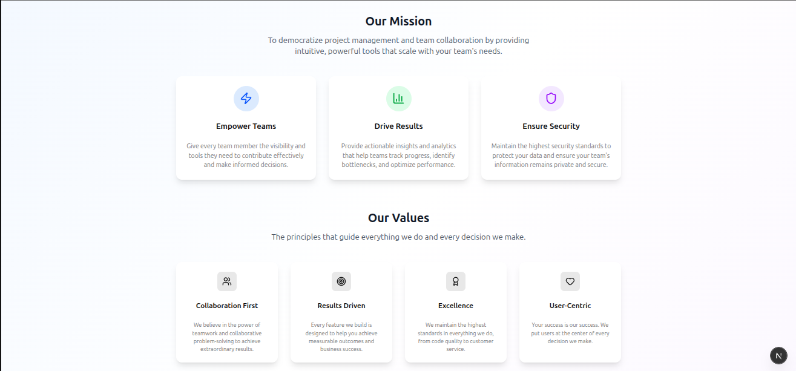
*Team invitation system and member onboarding*

### 📋 **Project Management**
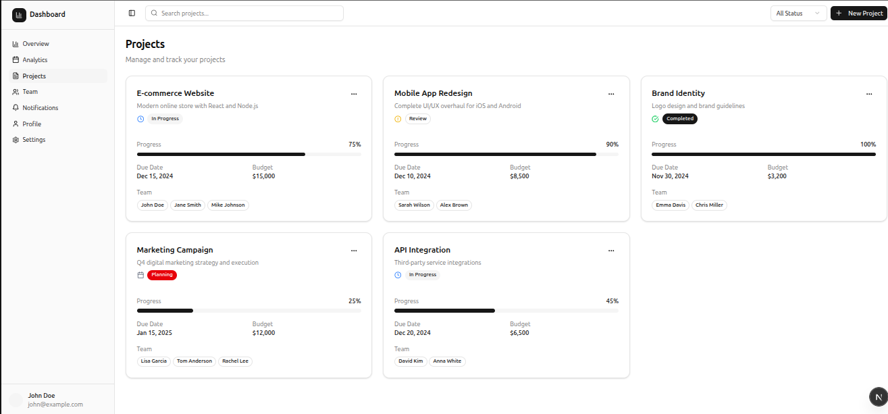
*Project management dashboard with progress tracking*

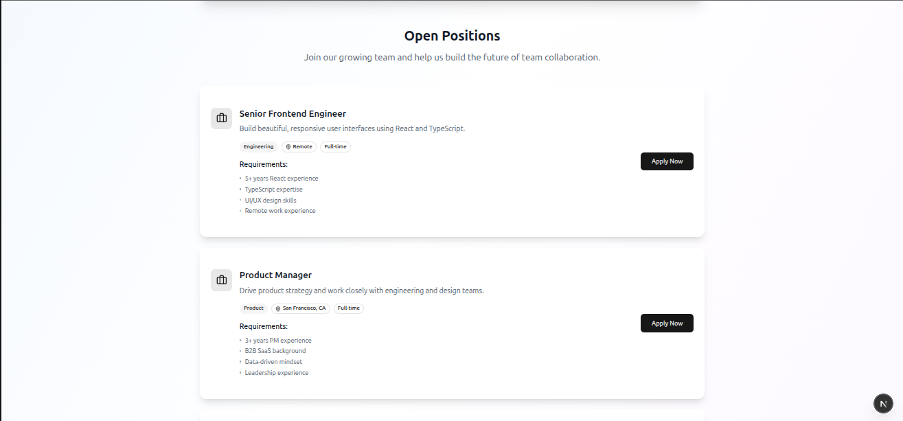
*Project creation wizard with templates and team assignment*

### 🔔 **User Features**
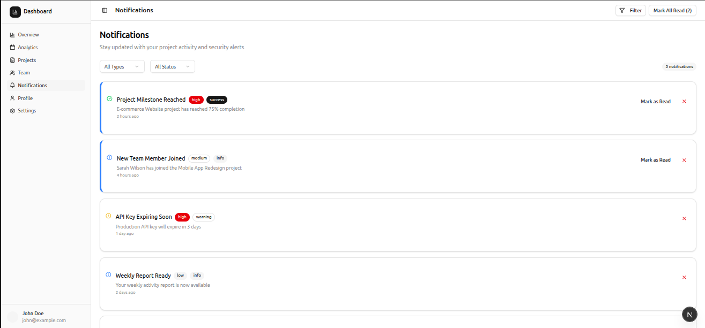
*Notification management with filtering and preferences*

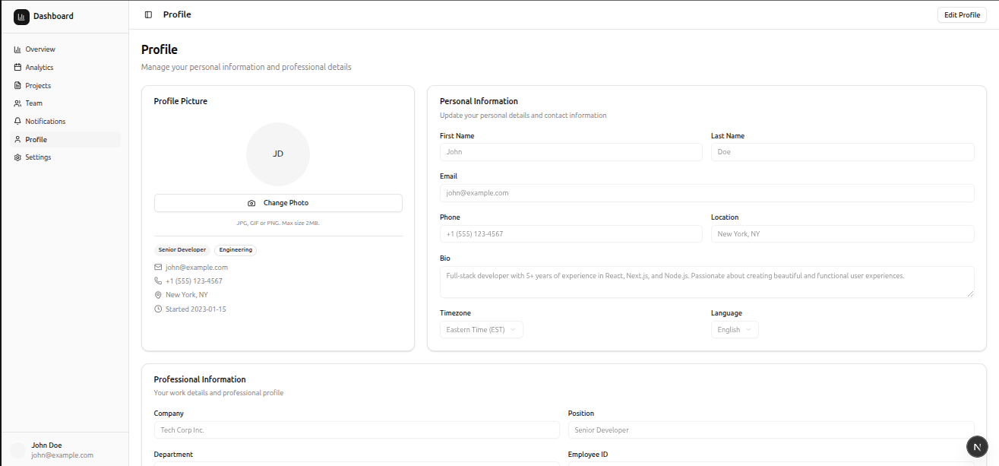
*Comprehensive user profile with personal and professional information*

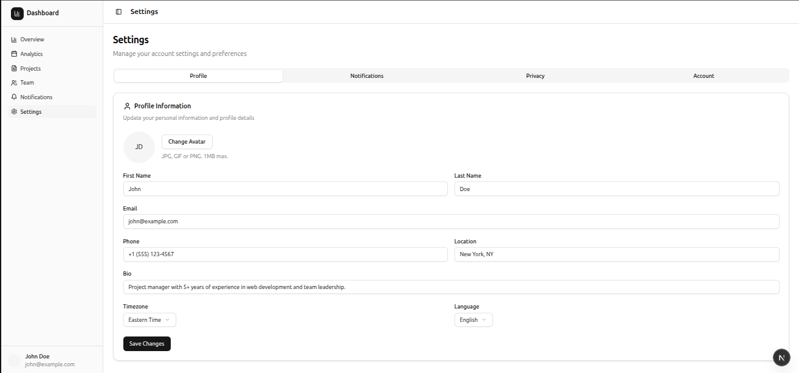
*Account and system configuration with preferences*

### 📝 **Blog System**

*Professional blog with article listing, search, and filtering*

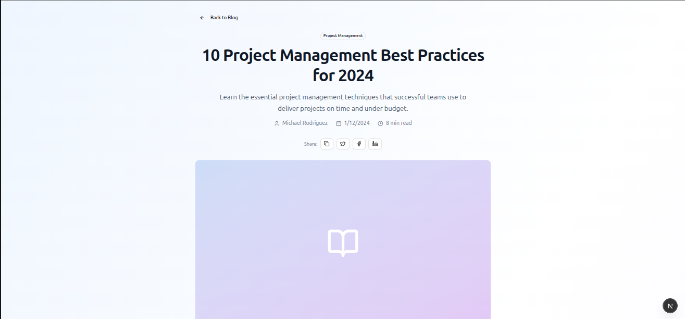
*Individual blog post with full content, sharing, and navigation*

### 📄 **Content Pages**
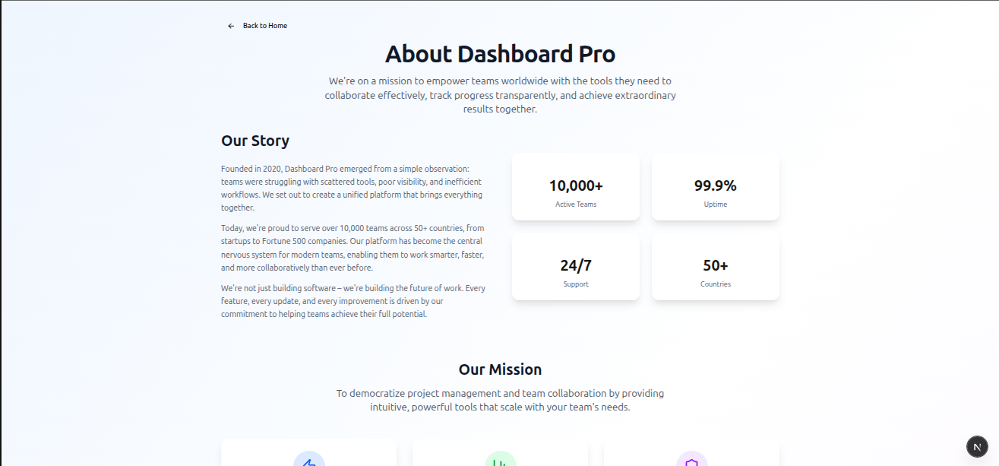
*Company information, mission, and team details*

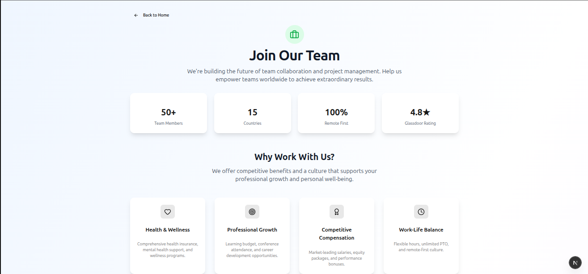
*Job openings, company culture, and benefits*

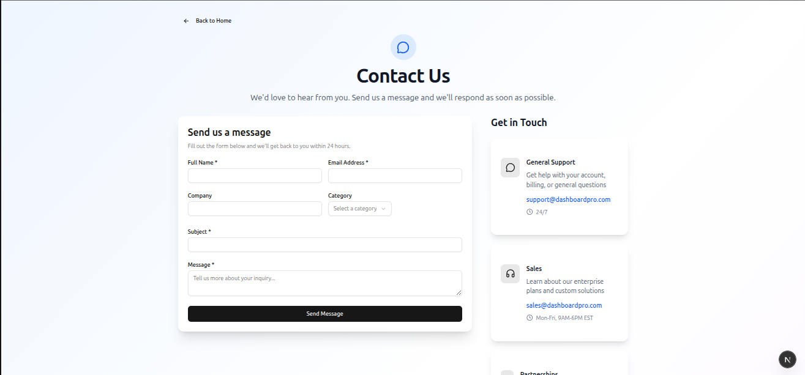
*Contact forms, office locations, and support channels*

---

*All screenshots showcase the responsive design and professional UI across different sections of the application. To view these images locally, navigate to the `/images` folder in your project directory.*

## 👨‍💻 Creator Information

**Created by:** Chief Strategist J (Jaydeep Wagh)

**Role:** Full-Stack Developer & UI/UX Designer

**Specializations:**
- Modern React/Next.js applications
- Professional UI/UX design
- Dashboard and admin panel development
- Team management systems
- E-commerce platforms
- Blog and content management systems

## 📞 Contact & Links

### 🌐 Social Media & Professional Profiles
- **Email:** [chief.stategist.j@gmail.com](mailto:chief.stategist.j@gmail.com)
- **Medium:** [https://medium.com/@scaibu](https://medium.com/@scaibu)
- **LinkedIn:** [https://www.linkedin.com/in/chiefj/](https://www.linkedin.com/in/chiefj/)
- **Twitter/X:** [https://x.com/ChiefErj](https://x.com/ChiefErj)
- **Instagram:** [https://www.instagram.com/chief._.jaydeep/](https://www.instagram.com/chief._.jaydeep/)

### 🚀 Services & Platforms
- **Discord Community:** [https://discord.com/invite/FzZPnjZa](https://discord.com/invite/FzZPnjZa)
- **Scaibu Website:** [https://scaibu.lovable.app/](https://scaibu.lovable.app/)
- **Service Booking:** [https://topmate.io/jaydeep_wagh/1194002](https://topmate.io/jaydeep_wagh/1194002)
- **Phone:** +91 9664920749

### 💼 Services Offered
- Custom web application development
- Dashboard and admin panel creation
- UI/UX design and implementation
- Team management system development
- E-commerce platform development
- Blog and CMS development
- API integration and development

## 📄 Project Structure

```
dashboard-pro/
├── app/                    # Next.js app directory
│   ├── (auth)/            # Authentication pages
│   ├── (dashboard)/       # Protected dashboard pages
│   ├── blog/              # Blog system with dynamic routes
│   └── [static-pages]/    # Public pages (about, contact, etc.)
├── components/            # Reusable UI components
├── hooks/                 # Custom React hooks
├── lib/                   # Utility functions and configurations
├── public/                # Static assets
└── [config-files]         # Next.js and tool configurations
```

## 🔧 Development

### Available Scripts
```bash
npm run dev     # Start development server
npm run build   # Build for production
npm run start   # Start production server
npm run lint    # Run ESLint
```

### Environment Variables
Create a `.env.local` file for environment-specific configurations:
```env
NEXT_PUBLIC_APP_URL=http://localhost:3000
# Add other environment variables as needed
```

## 📚 Learn More

This project demonstrates modern web development best practices:

- **Next.js Documentation:** [https://nextjs.org/docs](https://nextjs.org/docs)
- **TypeScript:** [https://www.typescriptlang.org/docs/](https://www.typescriptlang.org/docs/)
- **Tailwind CSS:** [https://tailwindcss.com/docs](https://tailwindcss.com/docs)
- **shadcn/ui:** [https://ui.shadcn.com/](https://ui.shadcn.com/)

## 🚀 Deployment

### Deploy on Vercel (Recommended)
1. Push your code to GitHub
2. Connect repository to [Vercel](https://vercel.com)
3. Deploy automatically on every push

### Other Platforms
- **Netlify:** [https://netlify.com](https://netlify.com)
- **Railway:** [https://railway.app](https://railway.app)
- **DigitalOcean App Platform:** [https://digitalocean.com](https://digitalocean.com)

## 📝 License

This project is for demonstration purposes. Feel free to use as reference or starting point for your own projects.

## 🙏 Acknowledgments

- **Next.js** for the amazing React framework
- **shadcn/ui** for beautiful and accessible components
- **Tailwind CSS** for utility-first styling
- **Lucide React** for comprehensive icon library
- **Vercel** for hosting and deployment platform

---

**⭐ This is a demo project showcasing modern web development capabilities. All features are fully functional with simulated data and interactions.**

---

> **🖼️ Image Viewing:** 
> - **Local Development:** Navigate to the `/images` folder in your project directory
> - **Direct Access:** Open any image file directly in your browser: `file:///home/j/live/dinesh/ai-worker/my-app/images/dashboard-screen.png`
> - **Quick View (Linux):** Run `xdg-open images/` from the project root
> - **Quick View (macOS):** Run `open images/` from the project root
> - **Quick View (Windows):** Run `start images/` from the project root
> - **GitHub:** When this README is viewed on GitHub, all images will display automatically
